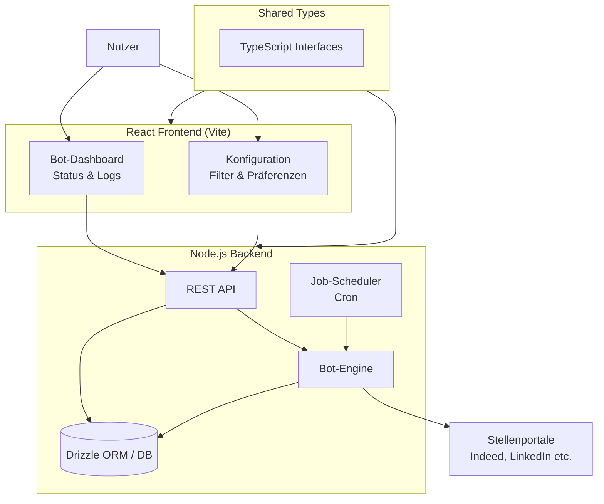

# Komponentendiagramm — Job Application Bot

```mermaid
graph TB
    subgraph Frontend ["React Frontend (Vite)"]
        Dashboard[Bot-Dashboard\nStatus & Logs]
        Config[Konfiguration\nFilter & Präferenzen]
    end

    subgraph Backend ["Node.js Backend"]
        API[REST API]
        BotEngine[Bot-Engine]
        Scheduler[Job-Scheduler\nCron]
        DB[(Drizzle ORM / DB)]
    end

    subgraph Shared ["Shared Types"]
        Types[TypeScript Interfaces]
    end

    JobPortale[Stellenportale\nIndeed, LinkedIn etc.]

    User[Nutzer] --> Dashboard
    User --> Config
    Dashboard --> API
    Config --> API
    API --> BotEngine
    API --> DB
    Scheduler --> BotEngine
    BotEngine --> JobPortale
    BotEngine --> DB
    Shared --> Frontend
    Shared --> Backend
```
